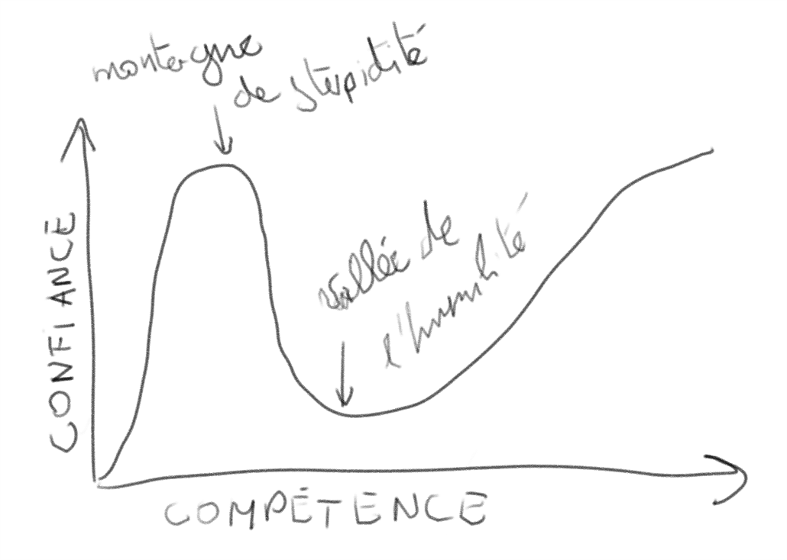
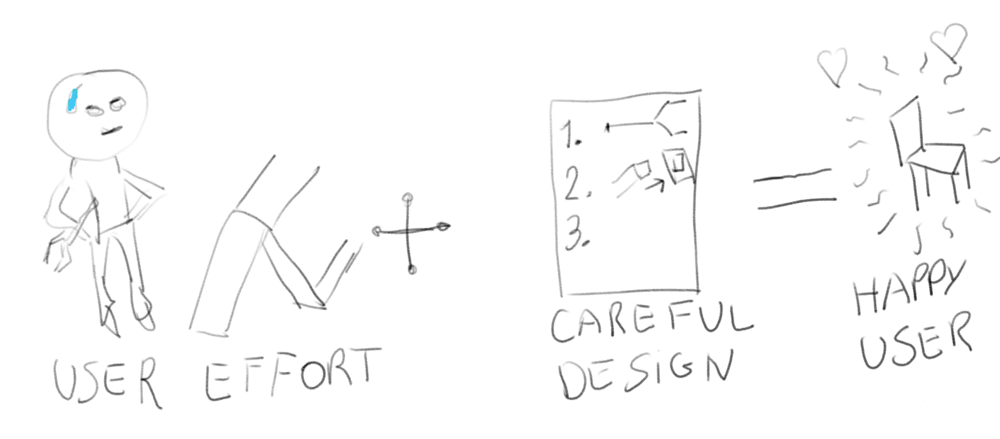

# Les biais cognitifs dans l'UX

J'ai décidé de travailler sur le thème des biais cognitifs car j'ai commencé, il y a quelques années, à lire le livre de Daniel Kahneman sur les biais cognitifs qui lui a valu un prix Nobel. 
D'autre part la perception biaisée que nous avons de la réalité me paraît évidente et surtout importante dans la mesure où elle nous amène parfois à avoir des comportements étranges d'un point de vue objectif. 
J'avais initialement prévu de me concentrer sur le marketing et les biais cognitifs cependant suite à votre remarque ainsi qu'à la difficulté du sujet je vais moins me concentrer sur le marketing et plus sur l'interaction homme-machine. 
Ce léger changement de thème devrait nous permettre de voir des choses plus amusantes et intéressantes mais surtout se rapprocher de ce que nous avons étudié lors de ce cours et ce que nous serons amenés à mettre en place dans nos futurs projets.

## Introduction

Un _biais cognitif_ est une erreur systématique de réflection qui amène un individu à avoir un jugement erroné ou prendre des mauvaises décisions [1].
Ce terme fut introduit par Daniel Kahneman et Adam Tversky en 1973 dans leur article dans Science et a fondé tout un domaine de la psychologie. 
Ces deux chercheurs ont identifié un certain nombre de biais et ont posé les bases de cette branche de la science du comportement.
Aujourd'hui beaucoup de biais supplementaires ont ete etudies par d'autres scientifiques et les biais sont étroitement étudiés par des chercheurs d'autres disciplines. 
Par exemple les chercheurs du marketing et de la finance s'y intéressent car ces biais ont le potentiel d'aider à exploiter les erreurs de jugement humain pour faire du profit. 

Pour rendre l'expérience homme-machine plus humaines les développeurs doivent prendre en compte les spécificités de l'être humain, notamment à travers ses biais cognitifs pour finalement rendre l'interaction plus intuitive.
Nous allons donc nous pencher sur quelques uns des biais cognitifs qui ont un impact direct sur l'expérience utilisateur, sur le développement de cette dernière et voir quelles sont les conséquences des ces biais.

## L'effet Dunning-Kruger

Cet effet, aussi connu sous le nom de l'_effet de surconfiance_ caractérise le fait que les personnes peu compétentes dans un domaine ont tendance a grandement sur-estimer leurs expertise alors que les experts ont la tendance inverse. 
Il fut introduit par Justin Kruger et David Dunning dans [2], ils ont mis en évidence cet effet grâce à de nombreuses expériences.
Le graphique ci-dessous représente le concept.

La leçon à tirer de ce biais cognitif est plus générale que pour une équipe de designers UX et pourrait être utile à n'importe quelle entité de collaboration mais elle stipule que des personnes sous-compétentes peuvent etre tres nefastes pour un projet. 
Une autre implication de l'effet Dunning-Kruger est que les experts ont tendance à grandement sous estimer leurs compétences ce qui peut les amener à la frustration quand d'autres personnes n'arrivent pas à reproduire leurs actions. 
C'est un comportement qui peut assez souvent être observé chez les enseignants chercheurs.

## L'effet IKEA

L'_effet IKEA_ est un biais cognitif qui caractérise le fait que nous avons la tendance à donner davantage de valeur à un produit auquel nous avons contribué.
Il a ete etudie par Michael Norton, Daniel Mochon et Dan Ariely a travers 3 études en 2011 [3]. 
Le nom de ce biais vient du géant Suédois dont le business model est presque entièrement basé sur le biais. 
En effet, malgré les prix plutôt attractifs de l'enseigne, de nombreux spécialistes attribuent le succès d'IKEA a ce biais. 
Les clients s'approprient leurs meubles lors de l'assemblage du kit, et ressentent davantage de plaisir a la fin qu'après un simple achat de meuble.

Les implications de cet effet sont multiples pour un designer UX, d'un côté, lors de la conception, un designer doit toujours prendre du recul sur le résultat et continuer à garder son but final en tête.

D'un autre côté, l'effet IKEA peut être un levier très puissant pour produire des logiciels avec une haute satisfaction de l'utilisateur en ajoutant un niveau de customisation adequat. 
Cette customisation peut porter autant sur des éléments d'esthétique (fonds d'écran, thème, couleurs) que sur des points organisationnels (emplacement des icônes, sélection de fonctionnalités clés).
Des exemples de telles utilisations qui permettent une appropriation de l'espace sont pas très nombreux mais on peut penser à l'écran d'accueil Windows, à la page "Home" de Google Chrome et ainsi de suite. 

## Le biais de confirmation

Le _biais de confirmation_ est un peu plus général et suggere qu'une personne cherche inconsciemment à confirmer les convictions qu'elle a déjà, ce biais est particulièrement dangereux pour les chercheurs et des méthodologies très sophistiquées cherchent à pallier cet effet.
Un designer UX n'est certainement pas à l'abri de ce biais et doit veiller à appliquer toutes le méthodes nécessaires pour garder l'objectivité dans son travail.
Le biais de confirmation pourrait intervenir notamment dans la phase de test du produit. 
Lors de cette phase les développeurs vont évaluer la performance de leurs implémentations et confronter des alternatives pour faire évoluer le produit final vers une solution optimale.
Une vigilance élevée est donc nécessaire afin d'éviter de rentrer dans des solutions biaisées.

D'autre part, cette phase de test est particulierement vulnerable aux biais cognitifs des testeurs notamment à travers de biais comme: 
 - l'_effet expérimentateur_ (quand l'expérimentateur influe l'expérience);
 - l'_effet de désirabilité sociale_ (on a tendance a faire les choix qui nous mettent en valeur à l'égard des autres au lieu de choisir ce que nous voulons réellement);
 - l'_effet Hawthorne_ (personne a tendance à agir différemment si elle est observée ou non);
 - le _biais de formulation_ (la formulation d'une question influe sur la réponse);
 - le _biais d'échantillonnage_ (une étude est valable uniquement sur la population ou elle a été conduite).

## Bibliographie

1. Kahneman 2012, p. 135 à 238 
2. Justin Kruger et David Dunning, « Unskilled and Unaware of It: How Difficulties in Recognizing One's Own Incompetence Lead to Inflated Self-Assessments », Journal of Personality and Social Psychology, vol. 77, no 6,‎ décembre 1999, p. 1121–34
3. Norton, Michael; Mochon, Daniel; Ariely, Dan (9 September 2011). "The IKEA effect: When labor leads to love" (PDF). Journal of Consumer Psychology. 22 (3): 453–460

